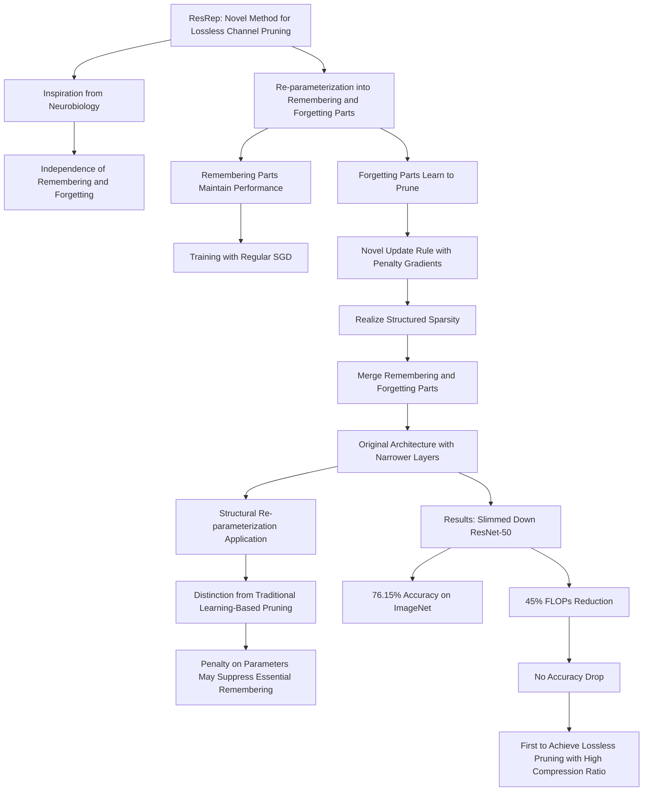

# ResRep: Lossless CNN Pruning via Decoupling Remembering and Forgetting

<show-structure for="chapter,procedure" depth="3"/>



## Abstract

- We propose to re-parameterize a CNN into the remembering parts and forgetting parts, 
  - where the former learn to maintain the performance 
  - and the latter learn to prune
- Via training with regular **SGD** on the **former** but **a novel update rule with penalty gradients** on the latter, we realize **structured sparsity**.
- Then we equivalently **merge** the remembering and forgetting parts into the original architecture with narrower layers. 
- In this sense, ResRep can be viewed as a successful application of _Structural_ **Re-parameterization**

## Introduction

### sparsity

#### Global sparse momentum SGD for pruning very deep neural networks 
<a href="https://arxiv.org/abs/1909.12778"></a>


To overcome the drawbacks of the two paradigms discussed above, 
- we intend to explicitly control the
eventual compression ratio **via end-to-end training** 
- by directly altering the **gradient flow** of momentum
SGD to **deviate the training direction** in order to achieve a **high compression ratio** as well as maintain
the accuracy

##### Approximation metrics


##### Rewritten SGD Rule


### Channel Pruning

<a href="https://arxiv.org/abs/2002.10179"></a>

- Our HRank is inspired by the discovery that
**the average rank** of multiple feature maps generated by a
single filter is always the **same**, regardless of the number of
image batches CNNs receive. 
- Based on HRank, we develop
a method that is mathematically formulated to prune filters
with **low-rank feature maps**. 
- The principle behind our pruning is that **low-rank feature maps** contain **less information**,
and thus pruned results can be easily reproduced.

### Quantization

#### Post training 4-bit quantization of convolutional networks for rapid-deployment
<a href="https://arxiv.org/abs/1810.05723"></a>

We use ACIQ for activation quantization and bias-correction for quantizing weights.
##### Analytical Clipping for Integer Quantization (ACIQ)

Assuming bit-width M, we would like to quantize the values in the tensor uniformly
to `2^M` discrete values.


##### Per-channel bit allocation


##### Bias-correction


#### Bi-real net
<a href="https://arxiv.org/abs/1808.00278"></a>

Bi-real net: Enhancing the performance of 1-bit cnns with improved representational capability and advanced training algorithm.: **Combining 1-bit with original feature map shortcut to keep information**

#### FOCUSED QUANTIZATION FOR SPARSE CNN
<a href="https://arxiv.org/abs/1903.03046"></a>

- Shift quantization of weights, which quantizes weight values in a model
  to **powers-of-two** or zero, i.e. {0, ±1, ±2, ±4, . . .}, is of particular of interest, as multiplications
  in convolutions become **much-simpler bit-shift operation**s.
- **Fine-grained pruning**, however, is often in conflict with **quantization**, as pruning introduces various
  degrees of sparsity to different layers. 
- Linear quantization methods (integers) have **uniform**
  quantization levels and non-linear quantization (logarithmic, floating-point and shift) have **fine levels
  around zero** 
- but levels grow **further apart** as values get **larger in magnitude**. 
- Both linear and nonlinear
  quantization thus provide precision where **it is not actually required** in the case of a pruned CNN
- We address both issues by proposing a new
  approach to quantize parameters in CNNs which we call **focused quantization** (FQ) that **mixes** shift
  and re-centralized quantization methods.


{thumbnail="true"}
> For example, 5 bits and normalization information could be enough to represent original distribution.
> 


```tex
m_\theta
```
is used to select which quantized component could be better to **fit the original distribution.**

### Knowledge Distillation
#### Geometry-Aware Distillation for Indoor Semantic Segmentation

<a href="https://ieeexplore.ieee.org/document/8954087"></a>


> Depth Embedding and pyramid of feature fusion to facilitate distillation

#### Structured Knowledge Distillation for Semantic Segmentation
<a href="https://ieeexplore.ieee.org/document/8954081"></a>

- Teacher and Student
- pair-wise distillation
  - learn association between each pair of pixels
- pixel-wise distillation
  - simply learn classification results of each pixel
- holistic distillation
  - Like GAN, with a discriminator network

#### Unifying Heterogeneous Classifiers with Distillation
<a href="https://arxiv.org/abs/1904.06062"></a>

- Merge Heterogeneous Classifiers into a single one.

### Typical Pruning Paradigm

{thumbnail="true"}

#### Auto-balanced filter pruning for efficient convolutional neural networks
<a href="https://ojs.aaai.org/index.php/AAAI/article/view/12262"></a>

- The word **auto-balanced** includes two meanings. 
- On the
one hand, according to Eq. 13, the intensity of stimulation
on strong filters **varies with** the weak ones. When the weak
filters are zeroed out, the stimulation automatically stops and
the training converges. 
- On the other hand, as the weak filters in a certain layer are weakened and the strong ones are
stimulated, the representational capacity of the weak part is
gradually **transferred** to the strong part, keeping the whole
layer’s representational capacity unharmed.

### Resistance & Prunability
We evaluate a training-based pruning method from two aspects. 

- Resistance
  - We say a model has high resistance if the performance **maintains high** during training.
- Prunability
  - If the model endures a high pruning ratio with low performance drop, we say it has high prunability.

We desire both high resistance and prunability, but the traditional penalty-based paradigm naturally **suffers** from a resistance-prunability **trade-off**.

### Two Key Components

ResRep comprises two key components: **Convolutional Re-parameterization** (Rep, the methodology of decoupling and the corresponding equivalent conversion) and **Gradient Resetting** (Res, the update rule for “forgetting”).


## Related Works

### The lottery ticket hypothesis: Finding sparse, trainable neural networks


